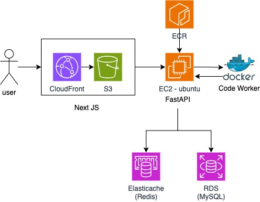
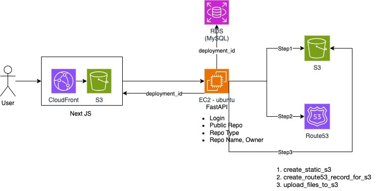
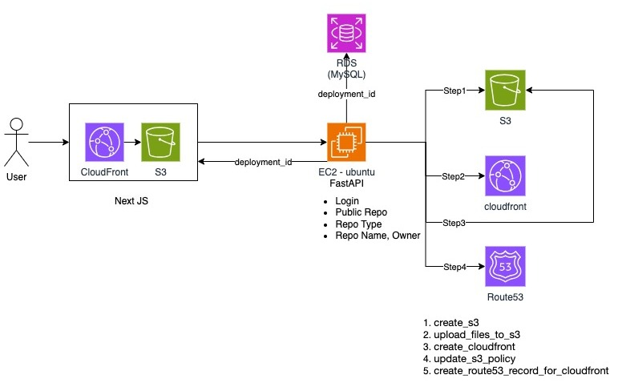
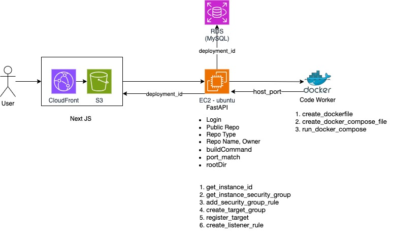
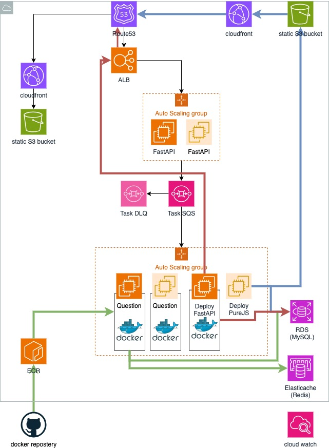

# Codewalker

[Codewalker](https://www.codewalker.cc/) is a platform designed for engineers, offering coding practice and website deployment solutions.

## Features

### Coding Practice

- Supports multiple programming languages:
  - JavaScript
  - Python
  - Java
  - C++
- Individual problem rankings
- Overall score rankings

#### Technical Implementation

- User submissions are processed by a FastAPI backend
- Answers are evaluated in language-specific Docker containers
- Docker images are pulled from ECR via systemd when the FastAPI backend starts
- Correct submissions are recorded in both Elasticache (Redis) and RDS
  - Elasticache uses Redis's sorted set feature for real-time rankings
  - RDS ensures long-term data persistence of ranking scores

### Website Deployment (using GitHub URL)

#### Common Features for All Deployment Types
- Provides a unique subdomain upon successful deployment
- Uses short polling to confirm successful deployment
  - After passing backend checks, a unique `deployment_id` is assigned and stored in RDS
  - This `deployment_id` is used for tracking deployment progress
- Performs backend checks prior to formal deployment

#### Static Website Deployment
- Supports both HTTP and HTTPS
- HTTP deployment: Uses Amazon S3 and Route 53
- HTTPS deployment: Uses Amazon S3, CloudFront, and Route 53
  - CloudFront is set up before updating S3 policies

HTTP Deployment Flow:

HTTPS Deployment Flow:

#### FastAPI Deployment
- Dynamically generates Dockerfile and docker-compose.yml based on user-provided env file
- Option to include Redis
- Automatically cleans up Docker resources after 15 minutes of successful container build
- Random Docker host_id allocation to avoid port conflicts on EC2 instances
  - This allows multiple projects to coexist on the same EC2 instance
  - Ensures efficient resource utilization and scalability
- If Redis is included, it's bound to the FastAPI container using Docker network

FastAPI Deployment Flow:

## Overall System Architecture

Our system architecture is designed for flexibility, scalability, and efficient resource utilization:

1. **Multi-purpose EC2 Instances**: Each EC2 instance can handle multiple types of workloads simultaneously, including FastAPI deployments, static website deployments, and coding practice evaluations.

2. **Color-coded Deployment Flows**:
   - Red lines: Represent FastAPI project deployments, which require server-side processing.
   - Blue lines: Indicate static PureJS project deployments.
   - Green lines: Denote the flow for coding practice functionalities.

3. **Resource Optimization**: While the diagram shows multiple EC2 instances for clarity, in practice, these services can coexist on fewer instances, maximizing resource efficiency.

4. **Scalable Architecture**: The system is designed to scale horizontally, allowing for the addition of more EC2 instances as demand grows.

5. **Service Isolation**: Despite sharing resources, each service (FastAPI deployment, static hosting, coding practice) is logically isolated to ensure security and performance.

This architecture allows us to efficiently manage diverse workloads while maintaining the flexibility to scale individual components as needed. It optimizes resource usage without compromising on the performance or isolation of different services.

## Getting Started

Visit [www.codewalker.cc](https://www.codewalker.cc/) to start using Codewalker's services.

